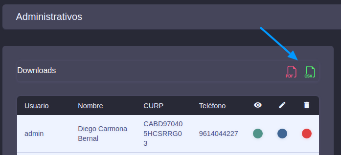
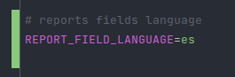
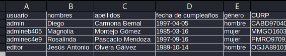
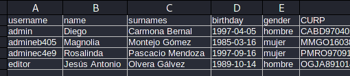
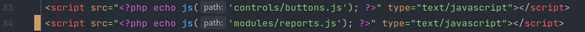

## CHANGELOGS

### Add XAMPP compatibility (Status: QA testing)
October 7 - 2022

* An autoloader(basic) of classes and namespaces has been created.
* A Penv class has been created to load environment variables in the `.env` file.
* Helper functions have been created in the `helpers.php` file.
* The routes have been modified so that the project works independently of the folder where it is located.

### Add report in CSV format (Status: QA testing | Report: administrate)
October 15 - 2022

* A new section was included to download the CSV report of all administrative users.
* The option to download the report at the moment is only available in the `administrative` module.  

* The language of the report fields are `hardcoded` and can generate the report with fields in spanish or english.
* You can change the language of the fields modifying the `REPORT_FIELD_LANGUAGE` value of the `.env` file.
* Consider that the separator of fields of the csv report is a semicolon symbol.

| Language | key                     | value   |
|----------|-------------------------|---------|
| Spanish  | `REPORT_FIELD_LANGUAGE` | es      |
| English  | `REPORT_FIELD_LANGUAGE` | en      |

* Spanish report, The first line contain the fields with the spanish language.

* English report, The first line contain the fields with the english language.

* Don't forget add the `reports.js` into index.php file of the administrative module.

### Add report in PDF format (Status: Undefined)
xxx-xxx xx - 20xx

* ...
