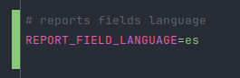
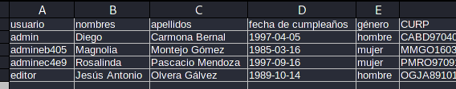
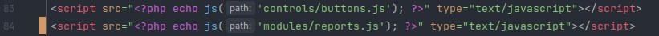

## CHANGELOGS

### Agregar compatibilidad con XAMPP (Estado: En pruebas)
Octubre 7 - 2022

* Se ha creado un autocargado(básico) de clases y namespaces.
* Se ha creado una clase Penv para cargar las variables de entorno del archivo `.env`.
* Se ha creado funciones de ayuda en el archivo `helpers.php`.
* Se ha modificado las rutas para que el proyecto funcione independientemente de la carpeta en donde se encuentre.

### Agregar reporte en archivo CSV (Estado: En pruebas | Reporte: administrativos)
Octubre 15 - 2022

* Se ha incluido una section para descargar un reporte de los usuarios administrativos.
* La opción de descargar reporte por el momento solo está disponible en el módulo `administratives`.

* El idioma de los campos del reporte csv están `hardcoded` y puede generar el reporte con campos en español o inglés.
* Para cambiar el idioma de los campos solo tendrá que modificar el valor de `REPORT_FIELD_LANGUAGE` del archivo .env
* Tener en cuenta que el reporte CSV se genera con el signo `;` como separador de campos.

| Language | key                     | value   |
|----------|-------------------------|---------|
| español  | `REPORT_FIELD_LANGUAGE` | es      |
| inglés   | `REPORT_FIELD_LANGUAGE` | en      |

* Reporte en español, la línea número 1 contiene los campos según el lenguaje seleccionado.

* Reporte en inglés, la línea número 1 contiene los campos según el lenguaje seleccionado.

* No olvidar agregar el archivo javascript `reports` en el index.php del módulo administratives

### Agregar reporte en archivo PDF (Estado: pendiente)
Diciembre xx - 2022

* ...
